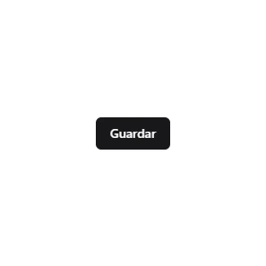
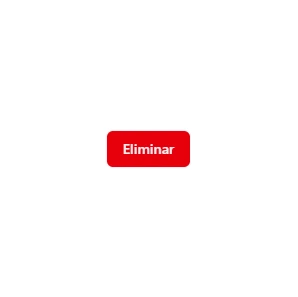
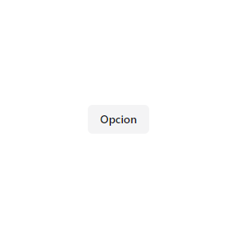
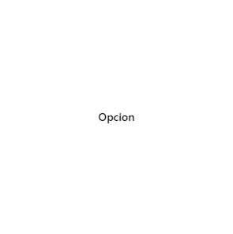
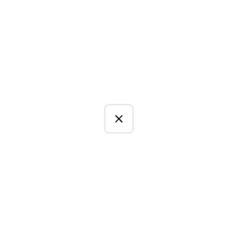
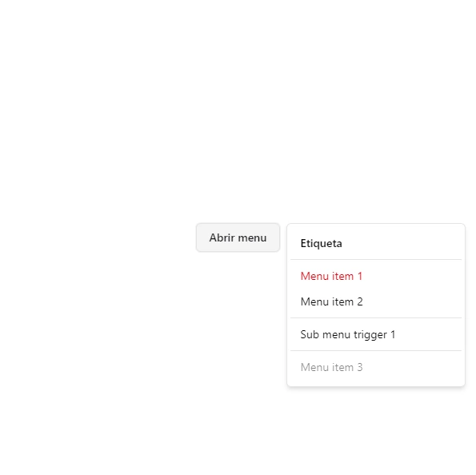
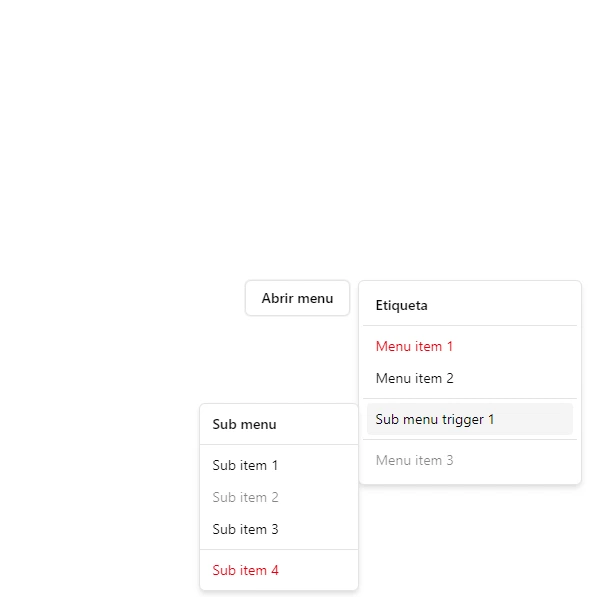

# 📚 Libreria de componentes UI

Este archivo contiene información detallada sobre cada componente reutilizable que forma parte del sistema de diseño.

Cada sección incluye:

- ✨ Descripción del componente
- 🛠️ Props y configuración
- 🎨 Variantes de estilo y tamaño
- 🧪 Ejemplos de uso en JavaScript puro
- 📸 Snapshots visuales (cuando sea posible)

Esta guía está pensada para ayudar a desarrolladores a integrar y mantener los componentes con claridad y consistencia visual.

---

## Índice

- [Button](#button)
- [DropdownMenu](#dropdownmenu)
- [...otros componentes]

---

# Componente `Button`

Un botón HTML creado dinámicamente con soporte para variantes y tamaños personalizables, ideal para interfaces reutilizables en JavaScript puro.

## Props

| Nombre    | Tipo             | Descripción                                                                                                                    |
| --------- | ---------------- | ------------------------------------------------------------------------------------------------------------------------------ |
| `label`   | `string \| Node` | Texto o nodo que se mostrará como contenido del botón.                                                                         |
| `onClick` | `function`       | Función callback que se ejecuta al hacer clic en el botón.                                                                     |
| `variant` | `string`         | Variante de estilo. Opciones: `default`, `destructive`, `outline`, `secondary`, `ghost`, `link`. Valor por defecto: `default`. |
| `size`    | `string`         | Tamaño del botón. Opciones: `default`, `sm`, `lg`, `icon`. Valor por defecto: `default`.                                       |

## Variantes de estilo

- `default`: Estilo principal.
- `destructive`: Color de advertencia/destrucción.
- `outline`: Botón con borde.
- `secondary`: Color alternativo.
- `ghost`: Sin fondo, solo texto.
- `link`: Simula un enlace.

## Tamaños disponibles

- `default`: Estándar.
- `sm`: Pequeño.
- `lg`: Grande.
- `icon`: Solo icono (cuadrado).

## Ejemplos de uso

### Default `Button`

```js
const button = Button({
  label: "Guardar",
  onClick: () => alert("Guardado"),
  variant: "default",
  size: "default",
});

document.body.appendChild(button);
```



### Destructive `Button`

```js
const button = Button({
  label: "Eliminar",
  onClick: () => console.log("Eliminado"),
  variant: "destructive",
  size: "default",
});

document.body.appendChild(button);
```



### Outline `Button`

```js
const button = Button({
  label: "Opcion",
  onClick: () => console.log("Acción ejecutada"),
  variant: "outline",
  size: "default",
});

document.body.appendChild(button);
```


### Secondary `Button`

```js
const button = Button({
  label: "Opcion",
  onClick: () => console.log("Acción ejecutada"),
  variant: "secondary",
  size: "default",
});

document.body.appendChild(button);
```



### Ghost `Button`

```js
const button = Button({
  label: "Opcion",
  onClick: () => console.log("Acción ejecutada"),
  variant: "ghost",
  size: "default",
});

document.body.appendChild(button);
```



### Link `Button`

```js
const button = Button({
  label: "Mi Link",
  onClick: () => console.log("Acción ejecutada"),
  variant: "link",
  size: "default",
});

document.body.appendChild(button);
```


### Icon `Button`

```js
const icon = createIcon("../assets/icons/x.svg");

const button = Button({
  label: icon,
  onClick: () => console.log("Acción ejecutada"),
  variant: "outline",
  size: "icon",
});

document.body.appendChild(button);
```



# DropdownMenu

Componente accesible y modular para construir menús desplegables y submenús, utilizando la API de popover nativa y anclas de CSS para posicionamiento.

---

## ✨ Características

- Compatible con popover nativo de HTML.
- Soporta submenús anidados.
- Estilos y variantes personalizables.
- Cierre automático al hacer clic en ítems interactivos.

---

## 🔧 API

### `DropdownMenu({ trigger, content, options })`

| Prop            | Tipo                | Requerido | Descripción                  |
| --------------- | ------------------- | --------- | ---------------------------- |
| `trigger`       | `HTMLElement`       | ✅        | Elemento que activa el menú. |
| `content`       | `HTMLElement`       | ✅        | Contenido del menú.          |
| `options.align` | `"bottom" \| "top"` | ❌        | Dirección del contenido.     |

---

### Subcomponentes

#### `DropdownMenuItem({ label, icon, variant, action, disabled })`

- Renderiza un `<li>` interactivo.
- Atributos como `data-variant` y `data-disabled` permiten aplicar estilos personalizados.

#### `DropdownMenuContent({ label, content })`

- Contenedor del contenido del menú.
- Si se incluye `label`, se renderiza como encabezado con separador.

#### `DropdownMenuSub(...)`

- Crea un submenú anidado.
- Aparece al pasar el mouse por encima del ítem padre.
- Usa eventos `mouseenter` y `mouseleave` para manejo visual.

---

## 🧪 Ejemplo de uso

```js
const menu = DropdownMenu({
  trigger: Button({ label: "Abrir menu", variant: "outline" }),
  content: DropdownMenuContent({
    label: DropdownMenuLabel("Etiqueta"),
    content: [
      DropdownMenuItem({ label: "Menu item 1", variant: "destructive" }),
      DropdownMenuItem({
        label: "Menu item 2",
        action: () => alert("Item pressed"),
      }),
      DropdownMenuSeparator(),
      DropdownMenuSub({
        label: "Sub menu trigger 1",
        content: DropdownMenuSubContent({
          label: DropdownMenuLabel("Sub menu"),
          content: [
            DropdownMenuItem({ label: "Sub item 1" }),
            DropdownMenuItem({ label: "Sub item 2", disabled: true }),
            DropdownMenuItem({ label: "Sub item 3" }),
            DropdownMenuSeparator(),
            DropdownMenuItem({
              label: "Sub item 4",
              variant: "destructive",
            }),
          ],
        }),
      }),
      DropdownMenuSeparator(),
      DropdownMenuItem({ label: "Menu item 3", disabled: true }),
    ],
  }),
  options: {
    align: "right",
  },
});

document.body.appendChild(menu);
```



